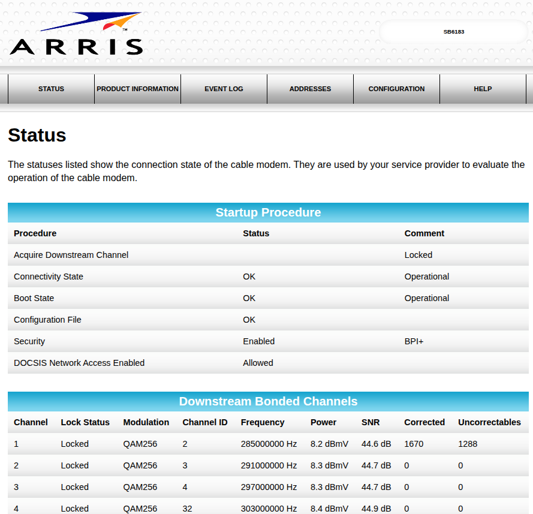

# ARRIS Cable Modem Integration for Home Assistant

[](https://github.com/custom-components/hacs)
[](https://www.gnu.org/licenses/old-licenses/gpl-2.0.en.html)
[](https://github.com/zerolagtime/hass-arris-cablemodem/releases)

Monitor your ARRIS cable modem's signal quality, connection status, and diagnostics directly in Home Assistant with automatic modem discovery!



## Features

-  **Automatic Discovery** - Finds your modem automatically on setup
-  **Comprehensive Monitoring** - Track all signal quality metrics
-  **Historical Data** - Full history and graphing support
-  **Automation Ready** - Create alerts for signal degradation
-  **Per-Channel Stats** - Individual metrics for each bonded channel
-  **Zero Configuration** - Works out of the box with common setups

## Supported Devices

- ARRIS SB6183 
- ARRIS SB6190 
- ARRIS TG1682G 
- ARRIS TG3482G 

Other ARRIS modems with similar web interfaces may also work!

## Sensors Provided

### Summary Sensors
| Sensor | Description | Unit |
|--------|-------------|------|
| Connectivity State | Overall modem connectivity | - |
| Boot State | Modem boot status | - |
| Security Status | Security/encryption state | - |
| Downstream Channels | Number of active downstream channels | count |
| Upstream Channels | Number of active upstream channels | count |
| Downstream Avg Power | Average downstream signal power | dBmV |
| Downstream Avg SNR | Average signal-to-noise ratio | dB |
| Upstream Avg Power | Average upstream signal power | dBmV |
| Total Corrected Errors | Cumulative corrected errors | count |
| Total Uncorrectable Errors | Cumulative uncorrectable errors | count |

### Per-Channel Sensors
- **Downstream Channels** (typically 16-32): Power (dBmV) and SNR (dB) for each
- **Upstream Channels** (typically 4-8): Power (dBmV) for each

##  Installation

### Method 1: HACS (Recommended)

1. **Open HACS** in your Home Assistant instance
2. Click on **Integrations**
3. Click the **three dots** in the top right corner
4. Select **Custom repositories**
5. Add this repository:
   - **URL**: `https://github.com/yourusername/hass-arris-cablemodem`
   - **Category**: `Integration`
6. Click **Add**
7. Click **Download** on the ARRIS Cable Modem card
8. **Restart Home Assistant**

### Method 2: Manual Installation

1. Download the `custom_components/arris_sb6183` folder from this repository
2. Copy it to your Home Assistant's `config/custom_components/` directory
3. The folder structure should look like:
   ```
   config/
   └── custom_components/
       └── arris_sb6183/
           ├── __init__.py
           ├── config_flow.py
           ├── const.py
           ├── manifest.json
           ├── modem.py
           ├── sensor.py
           ├── strings.json
           └── translations/
               └── en.json
   ```
4. **Restart Home Assistant**

##  Configuration

### Add Integration (UI)

1. Go to **Settings** → **Devices & Services**
2. Click **+ Add Integration**
3. Search for **ARRIS Cable Modem**
4. The integration will automatically scan for modems at common IP addresses
5. **If found**: Select your modem from the list
6. **If not found**: Enter your modem's IP address manually (usually `192.168.100.1`)
7. Click **Submit**

That's it! All sensors will be created automatically.

### Configuration via YAML (Not Supported)

This integration uses the UI config flow only. YAML configuration is not available.

##  Usage Examples

### Dashboard Card

Add a simple entities card to monitor your modem:

```yaml
type: entities
title: Cable Modem Status
entities:
  - entity: sensor.sb6183_connectivity_state
    name: Connection
  - entity: sensor.sb6183_downstream_average_power
    name: Downstream Power
  - entity: sensor.sb6183_downstream_average_snr
    name: Signal Quality (SNR)
  - entity: sensor.sb6183_upstream_average_power
    name: Upstream Power
  - entity: sensor.sb6183_downstream_total_uncorrectable_errors
    name: Uncorrectable Errors
```

### Signal Quality Graph

Create a history graph for signal monitoring:

```yaml
type: history-graph
title: Modem Signal Quality
entities:
  - entity: sensor.sb6183_downstream_average_snr
    name: SNR
  - entity: sensor.sb6183_downstream_average_power
    name: Power
hours_to_show: 24
refresh_interval: 0
```

### Low Signal Alert Automation

Get notified when your signal quality drops:

```yaml
automation:
  - alias: "Cable Modem - Low SNR Alert"
    description: "Alert when downstream SNR drops below acceptable levels"
    trigger:
      - platform: numeric_state
        entity_id: sensor.sb6183_downstream_average_snr
        below: 35
        for:
          minutes: 5
    action:
      - service: notify.mobile_app_your_phone
        data:
          title: "⚠️ Cable Modem Issue"
          message: "Downstream SNR is {{ states('sensor.sb6183_downstream_average_snr') }} dB (threshold: 35 dB)"
          data:
            priority: high
```

### High Error Rate Alert

Monitor for connection issues:

```yaml
automation:
  - alias: "Cable Modem - High Error Rate"
    description: "Alert when uncorrectable errors increase rapidly"
    trigger:
      - platform: state
        entity_id: sensor.sb6183_downstream_total_uncorrectable_errors
    condition:
      - condition: template
        value_template: >
          {{ (states('sensor.sb6183_downstream_total_uncorrectable_errors') | int - 
              trigger.from_state.state | int) > 1000 }}
    action:
      - service: notify.mobile_app_your_phone
        data:
          title: "⚠️ Cable Modem Errors"
          message: "High error rate detected on cable modem"
```

### Connectivity State Change Alert

Get notified of modem state changes:

```yaml
automation:
  - alias: "Cable Modem - Status Change"
    description: "Alert when modem connectivity changes"
    trigger:
      - platform: state
        entity_id: sensor.sb6183_connectivity_state
    condition:
      - condition: template
        value_template: "{{ trigger.to_state.state != 'OK' }}"
    action:
      - service: notify.mobile_app_your_phone
        data:
          title: "📡 Modem Status Change"
          message: "Cable modem status: {{ states('sensor.sb6183_connectivity_state') }}"
```

## Troubleshooting

### Modem Not Found During Setup

**Problem**: Auto-discovery doesn't find your modem

**Solutions**:
1. Click "Enter IP manually" and enter your modem's IP address
2. Common ARRIS modem IPs: `192.168.100.1`, `192.168.0.1`, `10.0.0.1`
3. Check your modem's documentation or router settings for the correct IP
4. Ensure your Home Assistant can reach the modem's web interface
5. Try accessing `http://192.168.100.1` in a web browser from the Home Assistant host

### Cannot Connect Error

**Problem**: "Failed to connect to modem" error during setup

**Solutions**:
1. Verify the IP address is correct
2. Ensure the modem's web interface is enabled (usually on by default)
3. Check if a firewall is blocking access
4. Confirm Home Assistant is on the same network as the modem
5. Test connectivity: `curl http://192.168.100.1` from the Home Assistant host

### Sensors Show "Unknown" or "Unavailable"

**Problem**: Sensors exist but show no data

**Solutions**:
1. Check Home Assistant logs for errors: **Settings** → **System** → **Logs**
2. Verify modem web interface is accessible
3. Reload the integration: **Settings** → **Devices & Services** → ARRIS Cable Modem → **⋮** → **Reload**
4. If issue persists, remove and re-add the integration

### Some Sensors Missing

**Problem**: Expected sensors don't appear

**Solutions**:
1. Your modem may have fewer channels than expected (this is normal)
2. Check the modem's web interface directly to see available channels
3. Per-channel sensors are created dynamically based on what the modem reports

## Signal Quality Guidelines

### Downstream Power (dBmV)
- **Optimal**: -7 to +7 dBmV
- **Acceptable**: -10 to +10 dBmV
- **Marginal**: -15 to +15 dBmV
- **Poor**: Below -15 or above +15 dBmV

### Downstream SNR (dB)
- **Excellent**: > 40 dB
- **Good**: 35-40 dB
- **Acceptable**: 30-35 dB
- **Poor**: < 30 dB

### Upstream Power (dBmV)
- **Optimal**: 35-50 dBmV
- **Acceptable**: 30-55 dBmV
- **Poor**: Below 30 or above 55 dBmV

### Errors
- **Corrected Errors**: Some are normal, monitor the rate of increase
- **Uncorrectable Errors**: Should be zero or very low; high counts indicate signal problems

## Contributing

Contributions are welcome! Please feel free to submit a Pull Request.

### Development Setup

1. Fork the repository
2. Clone your fork
3. Create a branch for your feature
4. Make your changes
5. Test with a local Home Assistant installation
6. Submit a pull request

### Testing Locally

```bash
# Copy to Home Assistant custom_components
cp -r custom_components/arris_sb6183 /path/to/homeassistant/config/custom_components/

# Restart Home Assistant
# Check logs for errors
```

## License

This project is licensed under the GNU General Public License v2.0 - see the [LICENSE](LICENSE) file for details.

## 🙏 Acknowledgments

- Thanks to the Home Assistant community for excellent documentation
- Inspired by other cable modem monitoring projects
- Built with ❤️ for reliable internet monitoring
- 100% written by Claude Sonnet 4.5

## Support

- **Issues**: [GitHub Issues](https://github.com/zerolagtime/hass-arris-cablemodem/issues)
- **Discussions**: [GitHub Discussions](https://github.com/zerolagtime/hass-arris-cablemodem/discussions)
- **Home Assistant Community**: [Home Assistant Forum](https://community.home-assistant.io/)

## 🗺️ Roadmap

- [ ] Support for additional ARRIS modem models
- [ ] OFDM/OFDMA channel support
- [ ] Modem reboot capability
- [ ] Advanced diagnostics and testing
- [ ] Multi-modem support for complex setups

---

**Made with ❤️ for Home Assistant**

If this integration helps you, consider giving it a ⭐ on GitHub!
